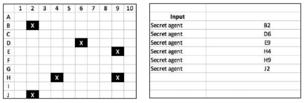
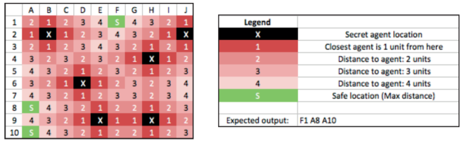
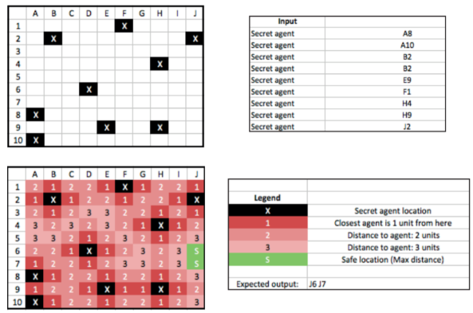

# Introduction

After being indicated as a whistleblower, Alex Riddle is being sought by the CIA. Alex went to Cologne,
Germany to get out of focus, but some secret agents are still following her. By accident, you received
information about the secret agents’ locations throughout Cologne and decided to help Alex by
sending her a list of **safe locations**.

Those safe locations are the ones, that are the furthest away to the closest agent, respectively those
with the **maximum distance to all agents’ locations**. Look at the city grid below, which illustrates
how the distance to an agent is defined based on an example input string.



**Input:** `['B2', 'D6', 'E9', 'H4', 'H9', 'J2']`

There are six agents in the city. Each location has a distance of 1 to their horizontally and vertically
neighbouring locations. For example, the agent on B2 has:

- distance 1 to B3,
- distance 2 to D2,
- distance 2 to A1,
- distance 4 to D4,
- ...

This becomes even more clear, when you look at the colored grid. It shows the safe locations for the
given example. Remember safe locations are the ones, that are the furthest away to the closest agent.



**Input:** `['B2', 'D6', 'E9', 'H4', 'H9', 'J2']`
Based on the Input the Output containing all safe locations would be ['F1', 'A8', 'A10'].
For example F1 is a safe location in this example because:

- the secret agents on B2, H4, and J2 are the closest agents (distance 5 to F1)
- the distance to the remaining agents is greater than the distance to B2, H4 and J2
- there is no location with a distance of 6 or greater to all of the agents

The safe locations are not necessarily the ones that have a distance of 5. The maximal distance to all
agents is relevant as the following example illustrates:



Write a program in a programming language of your choice to compute the list of safe locations. The
input to your program is a String with each word representing one agent’s location on the city grid. For
example “B2 D6 E9 H4” contains four agent locations with the first one being B2. The city grid
is 10 x 10 units and uses the letters A to J and the numbers 1 to 10 as coordinations.

Your program should likewise return the safe locations as a String with each word representing one safe location. For example, if your output is “F8 G7 H6”, there are three safe locations, one at F8, one
at G7 and one at H6 on the city grid.

**Special cases:**

If there are no agents in the city, the expected output is:

`The whole city is safe for Alex! :-)`

If there are no safe locations in the city (which can only be the case, if there is an agent placed on every location
unit), the expected output is:

`There are no safe locations for Alex! :-(`

Write clean code and think of edge cases! Your program should be able to return safe locations for
varying numbers of secret agents and no matter, where those are located. The input given above and below are
just some example cases out of many, your code should be able to solve. More examples
for inputs and expected outputs can be seen below.

Let’s code now, Alex is waiting!

**Here are some example inputs and expected outputs:**

**Example 1:**

```text
Input: A1
Output: J10
```

**Example 2:**

```text
Input: B4 C4 C8 E2 F10 H1 J6
Output: A1 A10 E6 F5 F6 G4 G5 G7 H8 I9 J10
```

**Example 3:**

```text
Input: A1 A10 B6 F2 J1 J10
Output: F8 G7 H6
```

**Example 4:**

```text
Input: A12
Output: The whole city is safe for Alex! :-)
```
